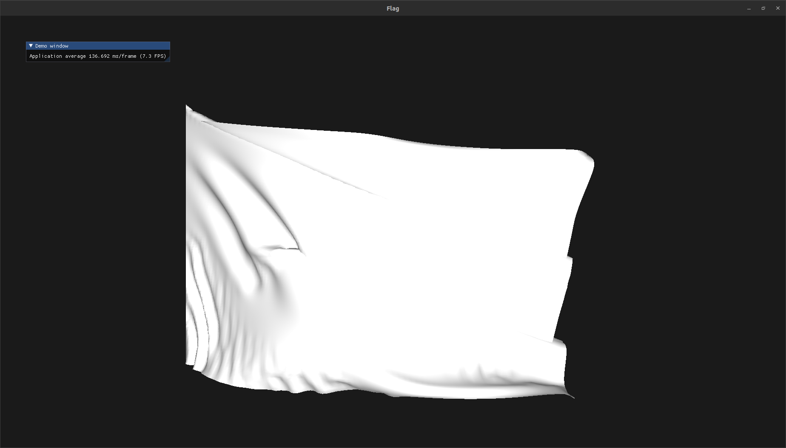
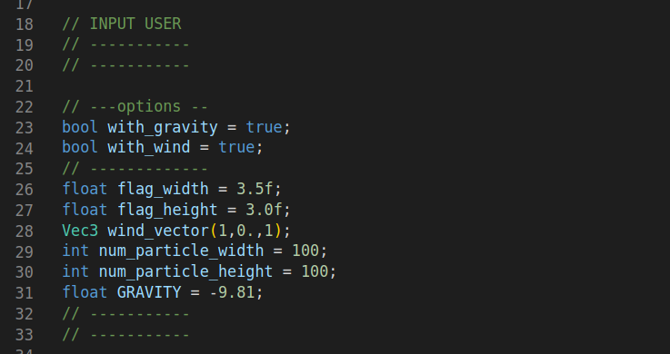

# Flag Viewer


## Requirements

Pour executer le projet vous aurez besoin d'un distributions linux basé sur Debian ainsi qu'un compilateur gcc capable de gérer du code c++>=11.

## Installation

```
git clone --recurse-submodules 
cd Fiber-level-Detail-Render
mkdir build
cd build
cmake ..
make
```

and to run

```
./../bin/FlagSimulation
```

## Courtes descriptions 

La logique du code du drapeau se trouve dans le fichier Base/Flag.cpp.
L'animation de vent fonctionne correctement mais il est souvent difficile de trouver les bonnes valeurs pour les paramètres de force et de masse qui ne font pas diverger le modèle. Pour aller plus loin nous aurions pus ajouter une interface plus simple à prendre en main pour modifier les paramètres.


Les inputs du modèle se changent directement au début du code du fichier src/main.cpp.


## Commandes de deplacement

| Command | Description |
|:---------:|:-----------:|
| `Z` | Move camera Forward, direction = vec3(0,0,-1)|
| `D` | Move camera right,  direction = vec3(1,0,0)|
| `S` | Move camera left,  direction = vec3(-1,0,0) |
| `Q` | Move camera back, direction = vec3(0,0,1) |
| `ESC` | Exit |


